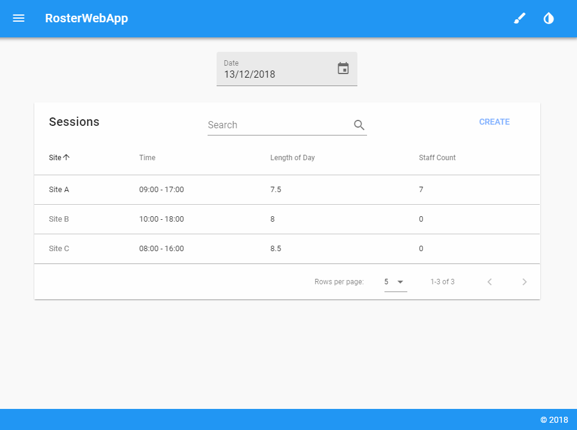
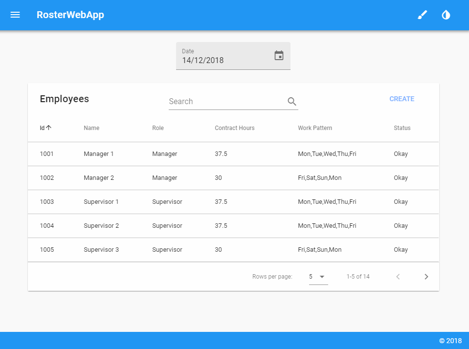
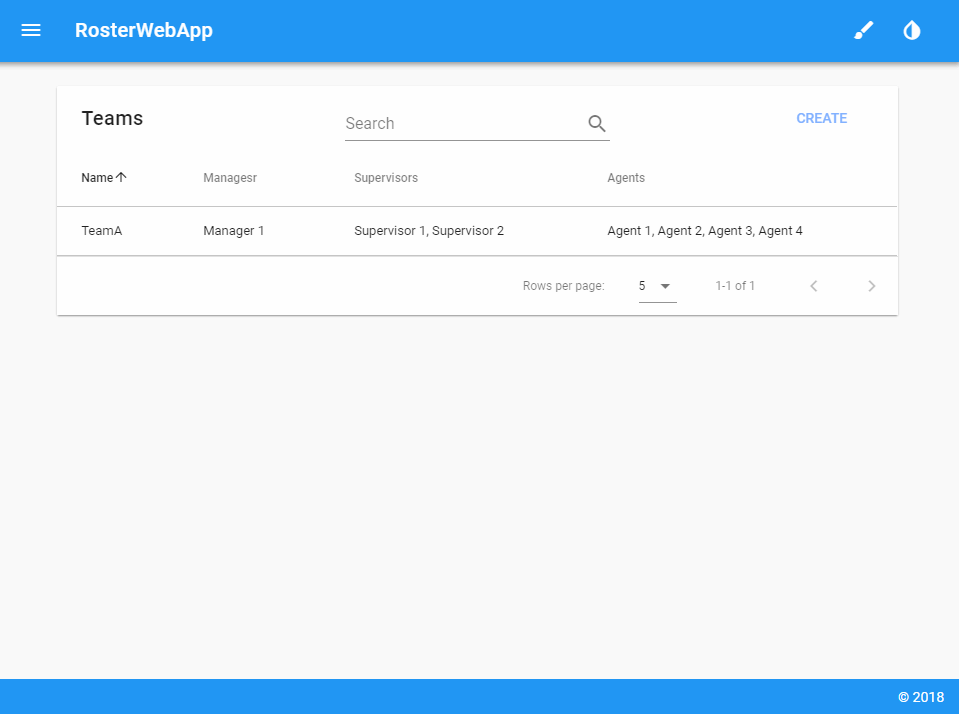
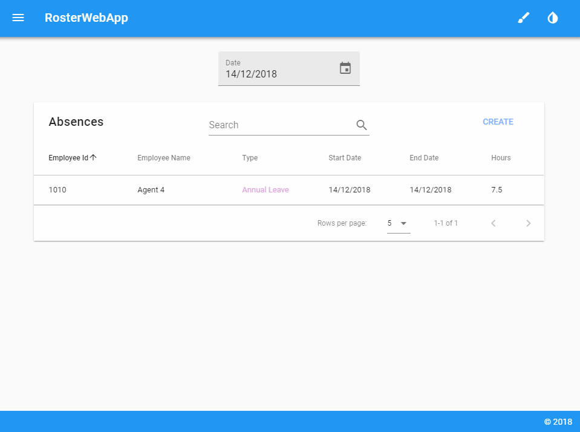
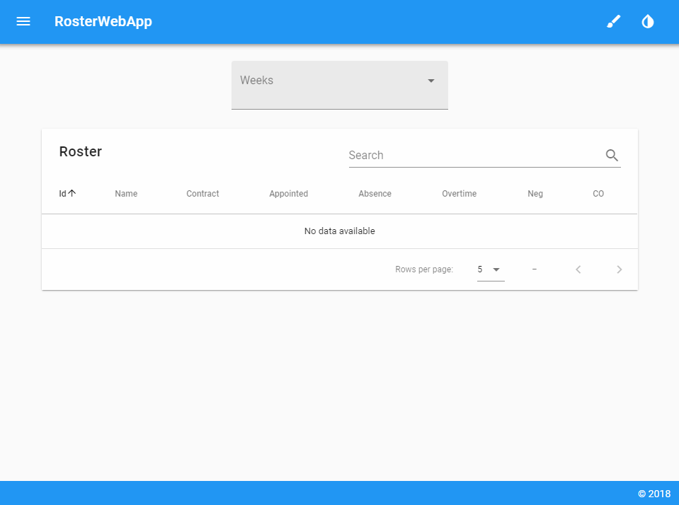
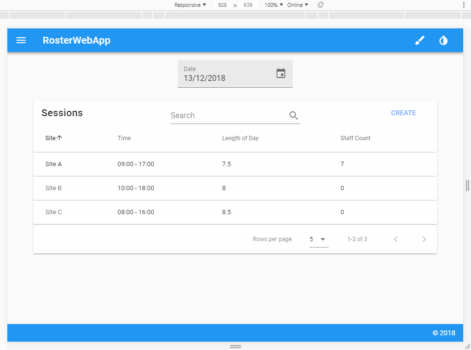
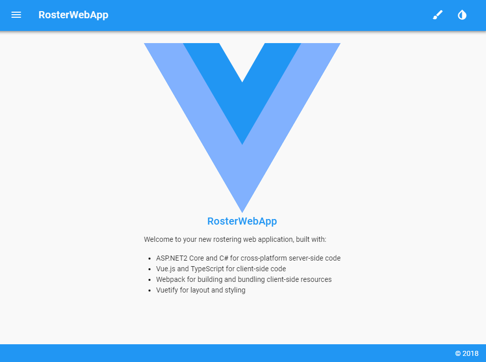
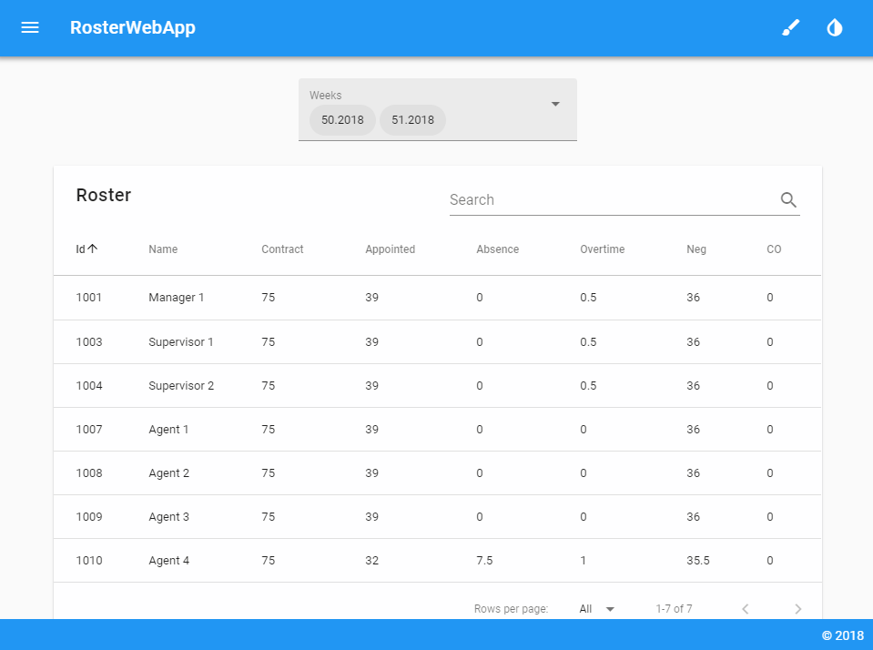

# RosterWebApp

Open source rostering web application which allows the rostering of employees/teams to work sessions with appointed and overtime hours. Includes standard CRUD operations, viewing of rostered hours, where an employee/team are between two given dates, assigning absences and other features. Feel free to use and adapt for your own uses or even take/ask how I did any features you like the look of. 

## Getting Started

These instructions will get you a copy of the project up and running on your local machine for development and testing purposes. See deployment for notes on how to deploy the project on a live system.

### Prerequisites

What things you need to install beforehand.

```
Node.js, ASP.NET Core, SQL Server 2016, Visual Studio 2017, Chrome/Firefox/Edge
```

### Installing

First download/clone the project:

```
git clone https://github.com/SnakeyHips/RosterWebApp.git
```

Then restore the project:

```
dotnet restore
```

Followed by installing the node modules:

```
npm install
```

You'll then want to create the MSSQL database for the project and create the relevant tables using the scripts within the `sqlscripts.txt` file. Make sure to also update the connection string to point to your database within `Connection.cs`:

```
public static string ConnString = "Data Source=(LocalDB)\\MSSQLLocalDB;AttachDbFilename=C:\\Source\\RosterWebApp\\RosterWebAppDB.mdf;Integrated Security=True";
```

With all that set up, open the `RosterWebapp.csproj` within Visual Studio and press F5 to start. The project can take some time to compile for the first time run which may result in a timeout error. If you receive this, just restart the project and it'll launch successfully since the initial build will be done.

## Tutorial

Examples of how to use the app along with additional features.

### Roster

The main function of the app is the ability to assign employees to a session and appoint either standard or overtime hours to each. The app is currently limited to only allow a max of 2 managers, 2 supervisors and 4 agents to each session just to point out you can limit the amount of roles. You can also appoint the roles based upon a Team once a Team is created:



The app is programmed so that an employee can only be rostered to a session if their work pattern (e.g. "Mon,Tue,Wed") contains the session's day of the week and if they don't have an absence on that day. Overtime hours relate to how many of the appointed hours are overtime. If the session is created either on a weekend or on a holiday date (initial holiday dates are Christmas and Boxing Day 2018 & 2019) then all hours are counted as overtime hours and so the overtime hours field is not rendered.

### View Employee 

You can view which sessions an employee is attending between two given dates:



### View Team

If you have a team created, you can also view which sessions each team member is attending between two given dates along with any absences a member may have:



### Assign Absences
You can assign absences to an employee with a date range and amount of hours. Each type is also given a unique colour to allow easy identity when viewing other components such as the Employee and Team View components.



Note, if an absence is assigned AFTER an employee is rostered to a session, they will still be rostered. You should unroster an employee from a session if they are going to be assigned an absence. I felt the implementation of an automatic unroster when assigning an absence afterwards would be too intrusive as I prefer to leave out as much automatic stuff as possible.

### View Roster Hours

You can then view the specific hours for every employee that has been rostered by week year:



The "Neg" (negative) hours are the difference of hours between those appointed and absenced compared to the employee's contract hours. The "CO" (carry over) hours are any overlapping hours in which the employee has been appointed and/or absenced more than their contract hours. Overtime hours don't count towards these values as overtime is an indication of how many of an employee's appointed hours are overtime.

### Responsive Design

With the awesomeness that is Vuetify, the app is fully responsive and even designed so that data tables change to data iterators for mobile screen sizes:



### Themes and Dark Mode

The app has the ability to change theme colour and enable a dark mode on the fly:


### Printing

The app also contains specific printing CSS to ensure only relevant information is displayed when printing the page:



## Built With

* [Node.js](https://nodejs.org/en/) - JS runtime to build the web app
* [Vue.js](https://vuejs.org/) - JS framework to build frontend
* [TypeScript](https://www.typescriptlang.org/) - strict syntactical superset of JS
* [Vuetify](https://vuetifyjs.com/en/) - to make frontend all pretty, Material Design and awesome
* [webpack](https://webpack.js.org/) - bundle everything together
* [ASP.NET Core](https://docs.microsoft.com/en-us/aspnet/core/?view=aspnetcore-2.2) - OOP language used for the backend
* [SQL Server 2016](https://www.microsoft.com/en-gb/sql-server/sql-server-2016) - create MSSQL Relational database for backend
* [Dapper](https://dapper-tutorial.net/dapper) - awesome micro-ORM for object mapping between database and controllers
* [Newtonsoft.Json](https://www.newtonsoft.com/json) - high-performance JSON framework for controllers

## Contributing

Please read the [CODE_OF_CONDUCT.md](https://github.com/SnakeyHips/RosterWebApp/blob/master/CODE_OF_CONDUCT.md) for details on the code of conduct when submitting issues and requests. It's just me so I will try my best so answer any issues/requests ASAP. 

## License

This project is licensed under the MIT License - see the [LICENSE](https://github.com/SnakeyHips/RosterWebApp/blob/master/LICENSE) file for details.

## Acknowledgments

* Half the users on stackoverflow.
